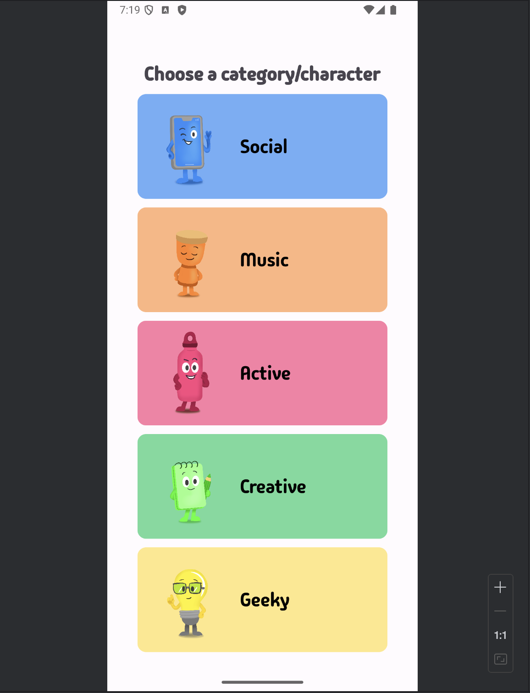
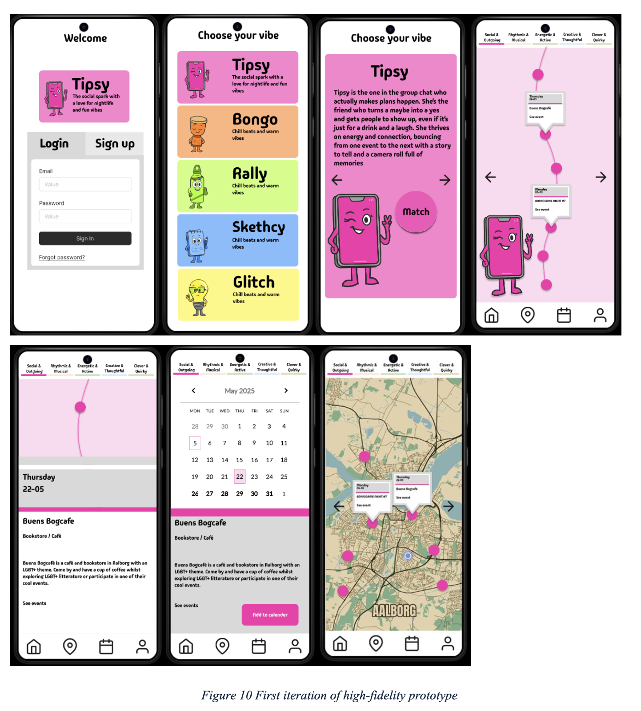
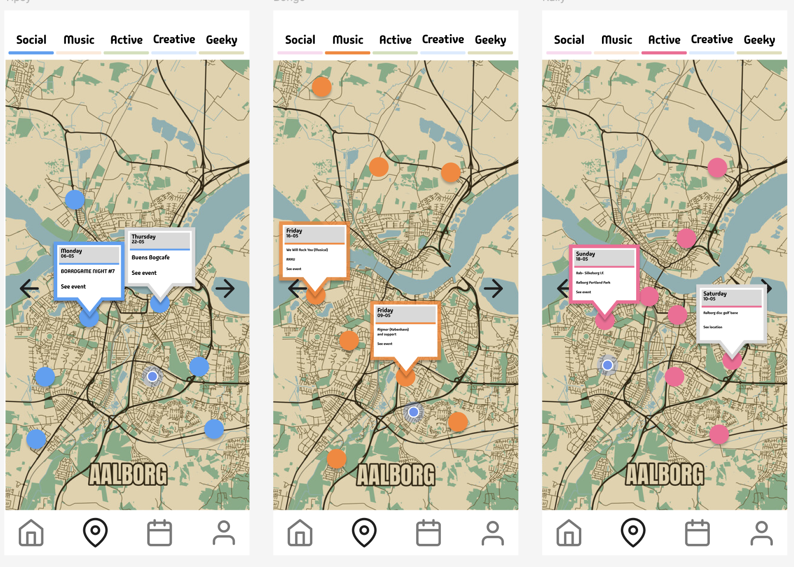
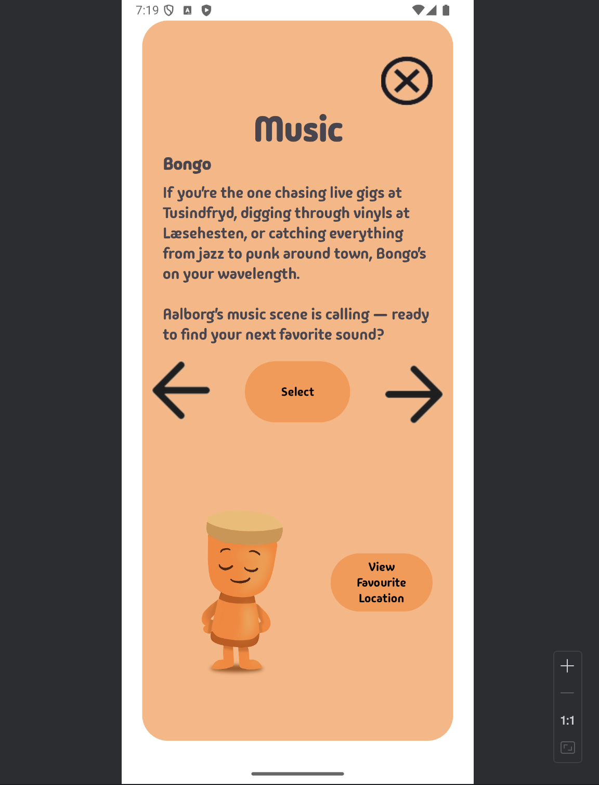
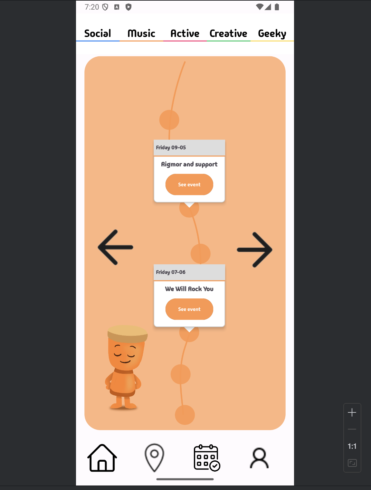
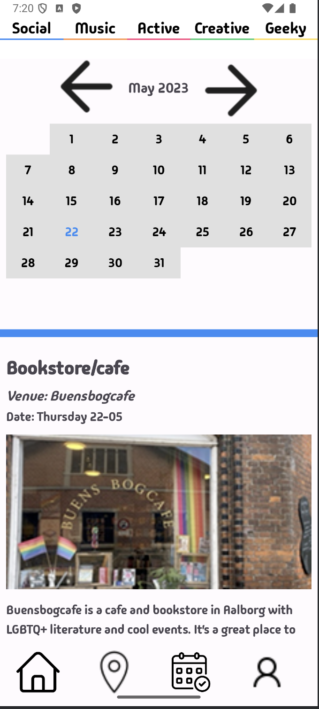
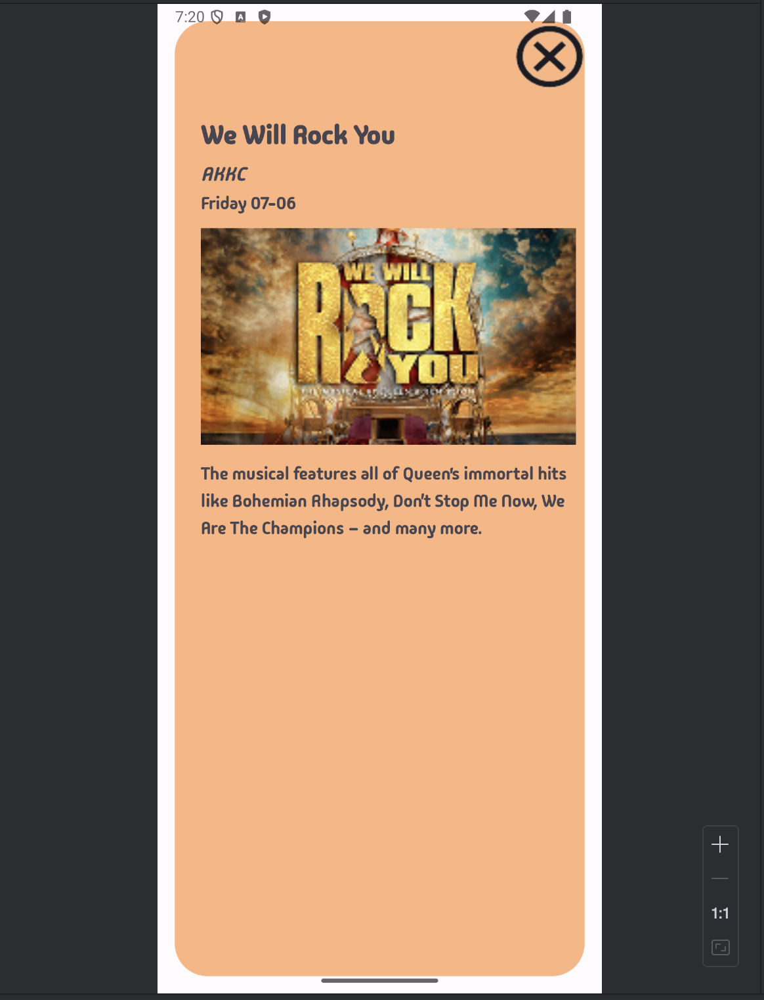
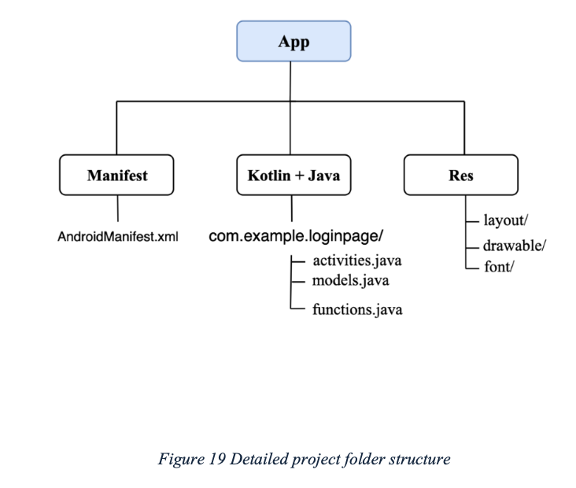
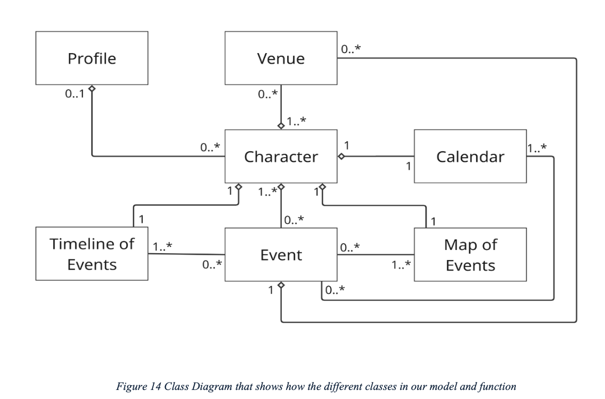

# Social Engagement App (Android)

An interactive Android application designed to help students discover local events based on their interests and preferences.

  

## Demo

  

[▶ Watch demo video](https://raw.githubusercontent.com/ceciliestadekristensen/social-engagement-through-interactive-design/main/demo.mp4)

---

## About the Project

This project explores how interactive design and Human-Computer Interaction (HCI) can support students—especially newcomers—in discovering social activities that match their interests.

The application introduces a character-based system that guides users toward relevant events, locations, and experiences in Aalborg.

---

## Design Process

The project follows an iterative and user-centered design approach based on:

* Human-Computer Interaction (HCI)
* Participatory Design
* Design Thinking

The development process included:

* User research and interviews
* Workshops and brainstorming sessions
* Multiple prototype iterations
* Usability testing and refinement

---

## Iterations

### Early Prototype

  
  

---

### Final Implementation

  
  

  
  

---

## System Architecture

### Project Structure

  

The project is structured into:
* Android manifest
* Application logic (Java/Kotlin)
* UI resources (layouts, drawables, fonts)

---

### Class Diagram

  

The class diagram illustrates the relationships between core components like characters, events, venues, calendar, and map features.

---

## Technologies

* Java
* Android SDK
* Android Studio
* XML (UI layouts)

---

## My Contributions

In this group project, I was involved in both the design and development, including:

### UI & Design
* Desig of the overall visual style and user experience
* Development of the character selection interface
* Contribution to the visual parts and layout of the app

### Features & Implementation
* Implementation of the timeline view for event browsing
* Development of parts of the calendar functionality
* Development of the character selection logic
* Building and improving UI components

### General Development
* Navigation system improvements
* Bug fixing and UI refinements
* Collaboration on the overall app structure

---

## Report

The full academic report for this project is available here:

[Download Project Report (PDF)](https://github.com/ceciliestadekristensen/social-engagement-through-interactive-design/raw/main/report/Report.pdf)

Key sections in the report:
* Timeline implementation (Chapter 4.3.4)
* Calendar functionality (Chapter 4.3.6)
* Character system (Chapter 4.3.1)

---

## Authors

* Benjamin Honoré Nielsen  
* Cecilie Städe Kristensen  
* Elia Hamann Ullerichs  
* Luna Annabell Linné Jensen  
* Sebastian Thomsen  
* Sofie Louise Fuglsang  

---

## Purpose

The goal of this project is to support social engagement and reduce loneliness among students, by making it easier to discover events and communities based on interests.
